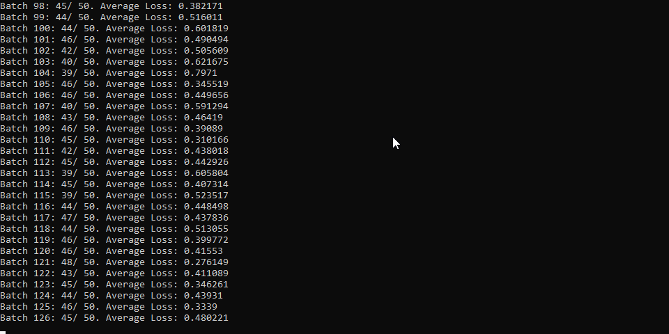

# simple-neural-network
multi layered perceptron made from scratch in C++, currently configured for the MNIST dataset.
Features implemented:

- Stochastic gradient descent
- Kaiming initialisation
- Gradient clipping
- Softmax, ReLU, Cross-Entropy loss

In testing, 96.21% accuracy in MNIST through a 2-layered NN with 128 HU & 3 Epochs

# Example image

